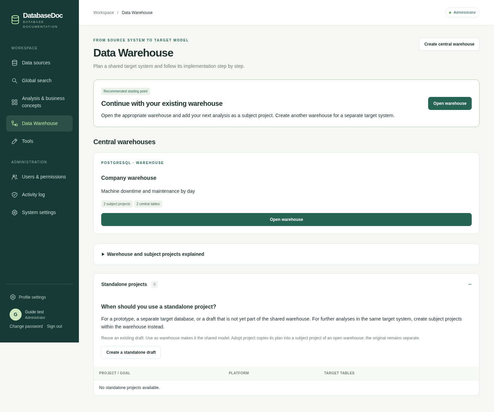
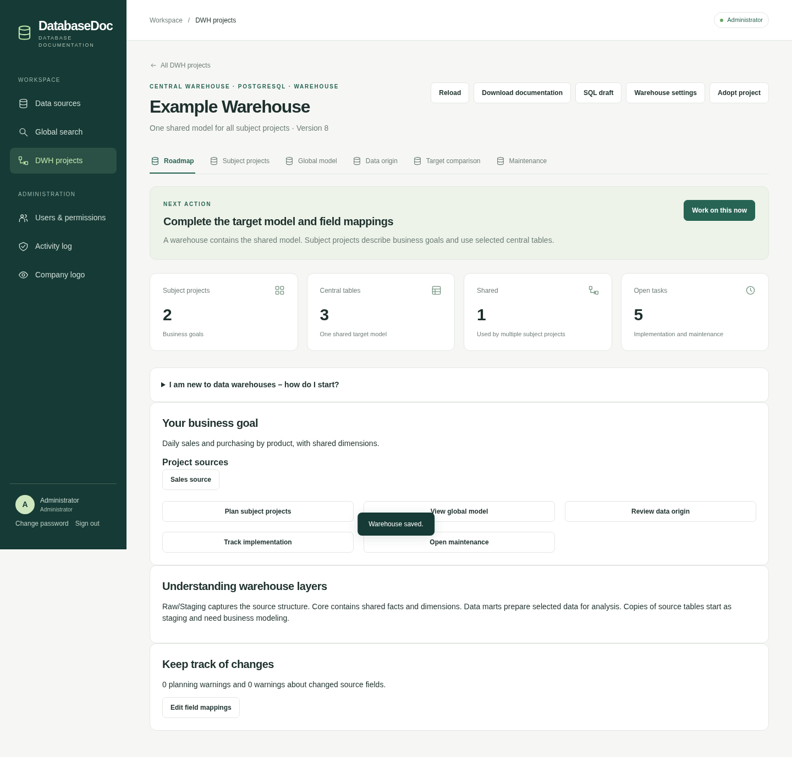
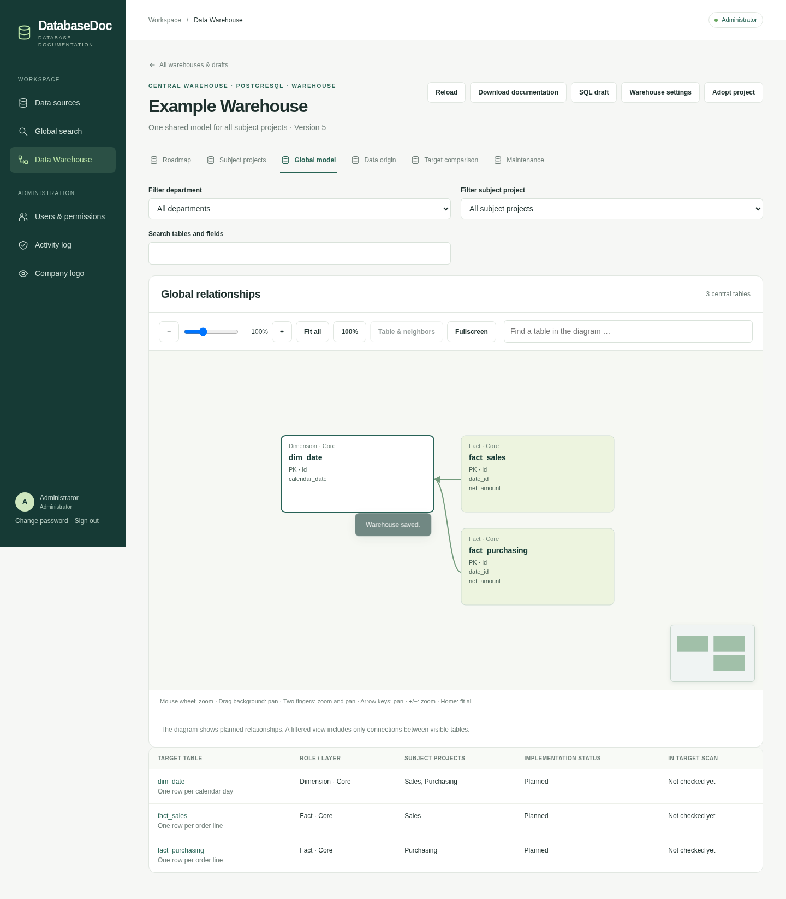
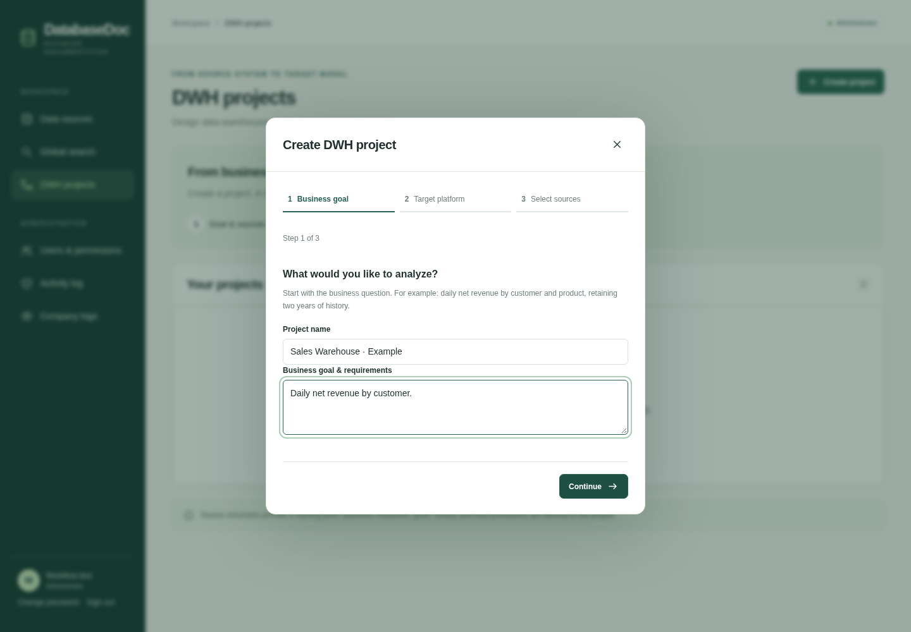
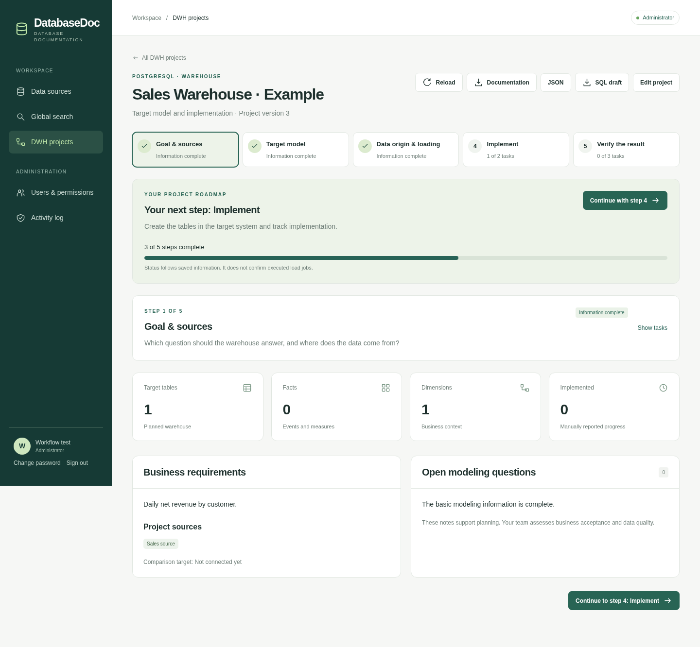
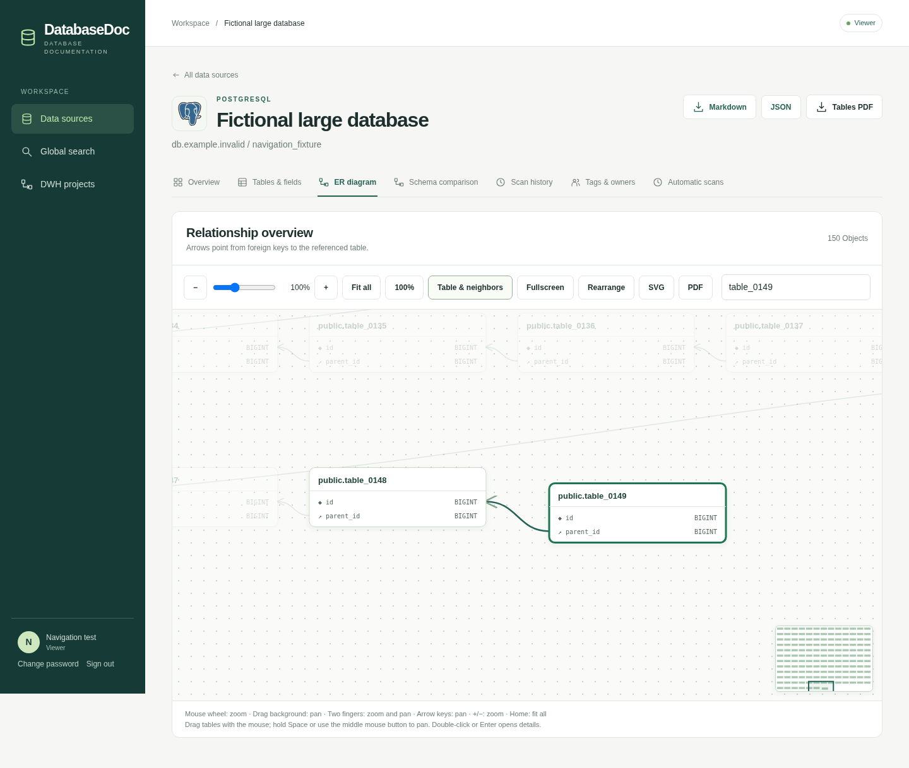
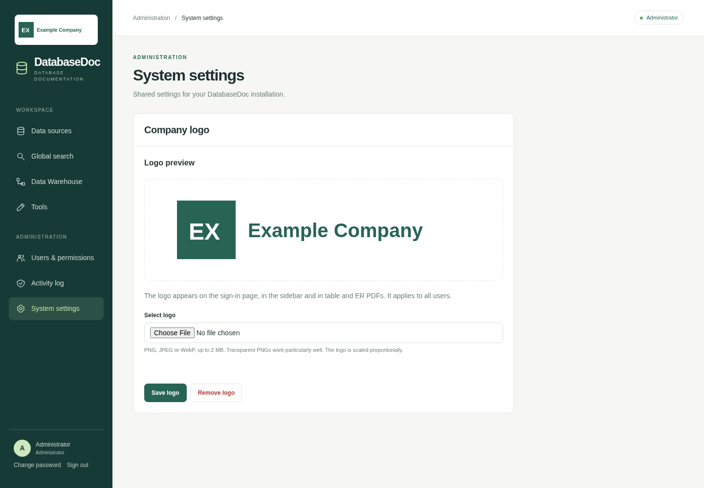
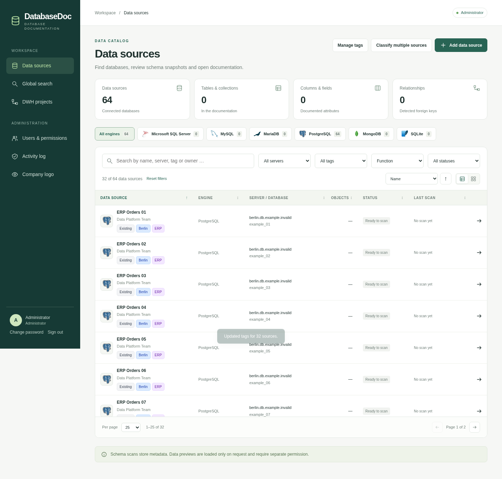

# DatabaseDoc

DatabaseDoc is a web application for documenting databases and data warehouses. It stores users, sessions, encrypted connections, schema snapshots, documentation notes, source ownership and tags, scan schedules, search indexes, and audit events in a separate MariaDB database.

Supported database adapters: **Microsoft SQL Server, MySQL, MariaDB, PostgreSQL, MongoDB, and SQLite**.

The interface supports English and German and automatically uses the first supported language in your browser preferences. Regional variants such as `de-DE`, `de-AT`, `en-US`, and `en-GB` are supported; English is the fallback when no supported language is listed. Reload the page after changing your browser language. This README and the configuration documentation are in English.

## Interface language

Navigation, forms, application messages, source documentation, global search, user administration, and warehouse planning are available in English and German. Dates, numbers, sorting and weekday names use the selected language. The document's `lang` attribute and page title are set accordingly. Application messages and PDF/Markdown export labels follow the request's `Accept-Language` preferences; JSON keys, database identifiers, and generated SQL identifiers remain stable. Technical SQL comments are in English.

Database names, comments, tags, owners, notes, business requirements, transformation descriptions, and preview values are shown exactly as recorded; they are not automatically translated. A shared English catalog lives in `app/static/translations.json`, with German application text as the source keys. Frontend translation helpers process application literals before interpolating user content. Backend language state is isolated per request, so users with different browser languages can work concurrently.

## Quick start

Requirements: Docker Engine and Docker Compose v2 on Linux AMD64 (x86-64), with network access to the databases you want to document.

```bash
git clone https://github.com/phillipunzen/database_doc.git
cd database_doc
bash scripts/init-env.sh
```

The initialization script uses **Bash and OpenSSL**, not a host Python installation. It creates `.env` with individual passwords and encryption/session secrets, with permissions `0600`. It does not print secrets or overwrite an existing file. If OpenSSL is missing on Debian, install it as root with `apt-get update` and `apt-get install -y openssl` (or prefix these commands with `sudo`). Alternatively, copy `.env.example` to `.env` and configure these values yourself.

Before starting, edit `.env`:

- Set `APP_URL` to the exact base URL you will use in your browser, such as `http://localhost:8090` for local development.
- Set `APP_PORT` and `APP_BIND` if you need a different port or bind address.
- Keep `.env` private. It contains application and database credentials.

```bash
mkdir -p sources
docker compose pull
docker compose up -d
docker compose ps
```

Open the URL configured in `APP_URL`. The default application port is `8090`; MariaDB does not expose a host port. The default `docker-compose.yml` downloads the prebuilt application image; no local Python environment or source build is needed to run it.

Existing deployments need no database migration for the DatabaseDoc rename. The internal MariaDB database/user and session-cookie identifiers retain their legacy names to preserve stored documentation and existing sign-ins. Backups created after the rename use the `databasedoc-` filename prefix; existing backups remain compatible.

The existing development deployment is available at **http://192.168.10.70:8090**, with its checkout at `/opt/datenbankdokumentation`.

### Generating keys manually on Debian (no Python)

For a **new installation**, the script above generates all five settings automatically. If you have already copied `.env.example` to `.env`, the script deliberately refuses to replace it. Generate the values manually and replace the corresponding placeholders in your editor:

```bash
# ENCRYPTION_KEY: keep the trailing = padding.
openssl rand -base64 32 | tr '/+' '_-'

# SESSION_SECRET: generate a separate value.
openssl rand -hex 32

# Run separately for APP_DB_PASSWORD, MARIADB_ROOT_PASSWORD and ADMIN_PASSWORD.
openssl rand -hex 32
```

The encryption key is URL-safe Base64 of 32 random bytes, as required by [Fernet](https://cryptography.io/en/latest/fernet/); [OpenSSL rand](https://docs.openssl.org/3.0/man1/openssl-rand/) supplies cryptographically secure random bytes. The other four values each use independent 32-byte random hex strings. After editing, run `chmod 600 .env`. Set `APP_URL` to the actual browser URL and then run `docker compose pull` and `docker compose up -d`.

Retain the existing `.env` for upgrades. Replacing `ENCRYPTION_KEY` makes previously stored connections unreadable; changing MariaDB password variables does not update users in an already initialized database volume.

## Prebuilt Docker image

The image is published to GitHub Container Registry as **`ghcr.io/phillipunzen/database_doc`**, linked to [this repository's packages](https://github.com/phillipunzen/database_doc/pkgs/container/database_doc). It contains the application, locally served assets, PDF fonts and database drivers including Microsoft ODBC Driver 18. The application runs as user UID `10001` and includes a health check. The supported native platform is **Linux AMD64**; ARM64 images are not currently published.

The [Docker image workflow](https://github.com/phillipunzen/database_doc/actions/workflows/docker-image.yml) builds the image and runs the application, catalog, PDF, warehouse, language, branding and central-warehouse tests before publishing. It uses GitHub's automatic `GITHUB_TOKEN` with package-write permission; no personal access token or registry password needs to be added to repository secrets. Pull requests build and test without publishing. Pushes to `main` publish `latest`, `main` and a `sha-<full commit SHA>` tag. Version tags such as `v1.0.0` publish `v1.0.0`, `1.0.0` and `1.0`; they do not replace `latest`. The workflow can also be run manually from the Actions page on `main`.

GitHub initially creates container packages as private, even for public repositories. The package owner can select **Package settings → Change visibility → Public** to allow unauthenticated downloads. If the package remains private, authenticate once before `docker compose pull` using a GitHub personal access token **(classic)** with `read:packages`:

```bash
docker login ghcr.io -u YOUR_GITHUB_USERNAME
```

Enter the token at Docker's password prompt; do not put it in the Compose file or commit it. See GitHub's [Container Registry documentation](https://docs.github.com/en/packages/working-with-a-github-packages-registry/working-with-the-container-registry) for package access and visibility.

To use a specific image instead of the moving `latest` tag, set `DATABASEDOC_IMAGE` in `.env`, for example `ghcr.io/phillipunzen/database_doc:sha-<full commit SHA>` or `ghcr.io/phillipunzen/database_doc@sha256:<image digest>`. The workflow summary records the published digest and tags.

The image contains no `.env`, credentials, SQLite source files or application database. MariaDB storage uses a persistent volume; SQLite sources are mounted read-only from `./sources`. Authentication, source connections, documentation, the company logo and warehouse models remain in MariaDB. Preserve `.env`, especially `ENCRYPTION_KEY`, when replacing containers or moving to another host.

### Updating an image deployment

Back up MariaDB and `.env` first. From the existing deployment directory, retaining the same Compose project name and volume:

```bash
docker compose pull app
docker compose up -d --no-deps app
docker compose ps
```

Changing the application image recreates only the app; startup adds any new application tables. Follow the release documentation for schema compatibility before downgrading an image. Never remove the database volume as part of an update.

### Building locally

For development, use the explicit build override instead of pulling the published image:

```bash
docker compose -f docker-compose.yml -f compose.build.yaml up -d --build
docker compose -f docker-compose.yml -f compose.build.yaml run --rm app python -c 'import app.main'
```

The override tags the local image `databasedoc:local` and builds it from the checkout. When building or recreating a local development container, keep using both `-f` options. Existing deployments upgraded from `compose.yaml` should remove that obsolete file so it cannot take precedence over `docker-compose.yml`; the repository now has only one default Compose file. The app/MariaDB service names, database credentials and `mariadb_data` volume key are unchanged.

## First sign-in

The initial username is `admin`, unless you set `ADMIN_USERNAME`. The generated initial password is stored in `.env` as `ADMIN_PASSWORD`; the initialization script creates this file with mode `0600`.

After signing in, use the password-change action in the sidebar to replace the initial password. The bootstrap variables create the administrator only when the application database contains no users. Changing `ADMIN_PASSWORD` in `.env` does not reset an existing account.

### Example database

The existing development deployment includes a source named **Beispiel · Bestellverwaltung** containing only fictional data. Open it to explore the table documentation or ER diagram. Its SQLite file is mounted read-only from `sources/beispiel.sqlite`.

The generated SQLite file is excluded from Git. To create it in a fresh checkout:

```bash
python3 scripts/create-demo.py
```

Then add a SQLite source in the application with the container path `/sources/beispiel.sqlite` and start a schema scan. The script does not overwrite an existing example file.

## Features

The source dashboard defaults to a compact list with locally served database-engine logos. Search by name, server, database, schema, tag, or owner; combine engine, server, tag, and scan-status filters; sort by name, engine, server, object count, status, or last scan. Pagination supports 25, 50, or 100 sources per page. An optional card view uses the same filters and pagination. Filters and page selection are retained while navigating between a source and the catalog. The mobile list uses compact stacked rows.

- Central warehouses with shared subject projects, a global target model, beginner guidance, source mappings, SQL generation for three engines, target comparison and manual maintenance records.
- Multiple data sources with individual connection settings and encrypted credentials.
- Database discovery on a server. Each source documents one database; an optional schema setting narrows the scan.
- Manual and scheduled background scans of tables, views, columns, data types, nullability, defaults, primary and foreign keys, indexes, unique constraints, and database comments where supported by the adapter.
- Interactive ER diagrams based on declared foreign keys, with pointer-centered zoom, panning, fullscreen, a minimap, table search, neighbor highlighting, draggable source tables, and complete SVG export. Diagrams include all scanned objects (up to the scanner limit of 2,000).
- Documentation notes for each object, retained across subsequent scans.
- Stored schema snapshots with comparisons of any two retained versions, plus JSON, Markdown, and PDF exports.
- Source tags, a responsible person or team, and contact email, shown in the catalog and documentation exports.
- Global search across the latest documented tables, columns, database comments, and object notes, restricted to sources granted to the signed-in user.
- Separately authorized data previews of up to 50 rows. Preview values are not persisted. Individual values are limited to 2,000 characters; binary values are represented by their size. There is no arbitrary SQL console.
- User management, source-specific access grants, an activity log, local authentication, and configurable Entra ID and Active Directory authentication.

For MongoDB, scans collect collections, indexes, and validators by default. Optional field inference reads up to 100 documents per collection and stores only field names and observed types. It may miss rare or unobserved fields. Relationships are not inferred from field names, and data previews require a separate permission.

Scans are limited to 2,000 objects and run on two threads in a single application process. The queue accepts up to ten active or queued jobs. After a restart, interrupted jobs are marked as failed and can be started again.

PostgreSQL materialized views, stored procedures, and ETL or pipeline lineage are not yet supported.

## Data warehouse projects

### Central warehouses and subject projects

Open **Data Warehouse** in the sidebar. The landing page explains the relationship between application databases, the shared warehouse, departments, and subject projects. The recommended action opens an existing central warehouse when one exists; otherwise, it starts a new central warehouse plan. Separate drafts are listed under **Standalone projects**, with guidance on when to use them.

| Item               | Purpose                                                                                      | Example                                        |
| ------------------ | -------------------------------------------------------------------------------------------- | ---------------------------------------------- |
| Central warehouse  | One shared target model and implementation roadmap for a target system                       | Company warehouse on PostgreSQL                |
| Department         | Organizational ownership of one or more subject projects                                     | Production or Maintenance                      |
| Subject project    | One business analysis within the shared warehouse, referencing central tables                | Machine data or Maintenance analysis           |
| Standalone project | An independent prototype, separate target system, or design not yet adopted into a warehouse | Trial design for a separate reporting database |

For a central company warehouse, create **one warehouse** and add further analyses as **subject projects inside it**. A subject project is not another warehouse database. A central warehouse owns the target tables, columns, relationships, and source mappings. Assigning the same dimension to two subject projects reuses its definition and UUID; it does not create a second physical table. For example, Production's Machine data project and Maintenance's Maintenance analysis project can use the same `dim_machine`, `dim_date`, and location definitions. All central tables currently use one target schema/database.

**Your first warehouse, using machine data as an example:**

1. **Set up warehouse:** enter the overall purpose, target platform (SQL Server, PostgreSQL, or MariaDB), and target schema/database. This creates a planning record in DatabaseDoc; provision the actual target database in your chosen system separately. Add a target connection when it is ready.
2. **Define a subject project and department:** add Machine data, department Production, an owner, and a specific question such as daily idle minutes per machine. Additional analyses and departments remain part of the same warehouse.
3. **Understand application data:** select the relevant application sources in Warehouse settings. Open and scan each source, then inspect its documentation and ER model. Verify meanings, timestamps, units, and keys. Scanning stores metadata; it does not copy rows into the warehouse.
4. **Design the shared target model:** use a starter draft or plan tables manually. For example, a `fact_machine_events` row describes one machine event with a measure such as `idle_minutes`, linked to machine and date dimensions. Adapt the starter calendar/fact draft and add the machine dimension, its fields, and relationships yourself. Importing a source structure produces a staging draft requiring review; selecting a source does not design a business model automatically. Assign the appropriate central tables to each subject project.
5. **Plan data origin and loading:** map target fields to scanned source fields or document derivations. Specify transformations, refresh frequency, history, deletion handling, and error/retry behavior. These mappings are a specification for load jobs, not an executed data transfer.
6. **Build the warehouse in the target system:** download and review the shared SQL draft, then execute it in the provisioned target system. Implement and test the ETL/load jobs separately, including regular execution. Update table implementation statuses and record implementation results under Maintenance. The SQL export defines structures; it does not contain ready-to-run ETL jobs.
7. **Verify results and maintain operations:** connect the actual target as a source, scan it, and compare its schema with the plan. Also reconcile measures, row counts, completeness, and freshness with the applications; record results, owners, and review dates under Maintenance.

The warehouse **Roadmap** displays these seven steps with **Your task**, **In the tool**, **Expected result**, context-specific actions, and documented status. It expands the next incomplete step. Source, subject-ownership, and implementation/quality counts show what remains. Model and mapping readiness follows saved definitions. Implementation also requires documented implementation tasks; a matching schema alone does not complete data validation. Quality results and an operational task with an owner and review date are required for the final documented step. This is documentation progress, not evidence that DatabaseDoc has executed SQL or verified running ETL jobs.

Each subject project has an optional **Department** and an **Owner**. Department filters apply to subject cards, the global model, data origin, and maintenance. Global maintenance tasks remain visible when filtering a department. Shared tables appear in each department that uses them, with the same central definition. Department labels are case-insensitively grouped; older records without a department appear under **No department assigned**. Assigning departments does not grant or restrict access: warehouse access still follows the grants for all assigned sources and the optional target. The model editor identifies whether you are editing a shared warehouse model or a standalone draft, and provides a link back to the warehouse roadmap.

The warehouse offers six views:

1. **Roadmap:** the seven-step build journey above, source links, next actions, documented status and model/source-change hints. It explains facts, dimensions, grain, staging, and the transition from a plan to external implementation.
2. **Subject projects:** document the business question, department and owner, and select shared central tables. The optional starter assistant creates a fact table with an identity key, a date reference and one decimal measure, plus a shared `dim_date` dimension. Specify what a row represents and the measure's meaning/unit; review types, decimal precision, calendar semantics, mappings and loading strategies before implementation. Subsequent starter models reuse a compatible `dim_date`. These are planning drafts; no source data or target DDL is executed.
3. **Global model:** view all planned relationships, filter by department and subject project and search table/field names. The global diagram includes up to all 300 allowed target tables; pointer-centered zoom, panning, a minimap, table search and subject filters keep it navigable. Filtered diagrams show relationships between visible tables. The object inventory shows shared use, manually reported implementation status and structural differences from the latest target scan. Select a table to edit its central definition with the existing five-step modeling workflow.
4. **Data origin:** inspect source fields/snapshot IDs and derivation rules across subject projects. Editors can open a field's mapping directly. Results initially show 100 fields, with a load-more action for larger models; search remains available across all matching fields.
5. **Target comparison:** inspect the latest successful stored target scan against the shared model, including missing/changed structures, extra columns and extra target tables. Open the target source to scan it or inspect its scanned ER model. This verifies documented structure, not loaded values, executed ETL jobs or business correctness.
6. **Maintenance:** track implementation, data-quality and operational tasks with an owner, optional subject project, review date, status and result notes. Completed tasks require documented results. Initial tasks cover SQL review, load-job implementation/error handling, measure reconciliation, freshness checks and backup/recovery tests. These are manual records; due dates do not schedule load jobs, checks or notifications.

To implement the first warehouse, define a subject project and starter/manual model, complete source mappings and loading/history rules in the modeling workflow, then export the shared SQL draft. Review and run it in the intended target system and implement/test load jobs there. Bind and scan the target, compare its structure, and record data reconciliations and subsequent review work under Maintenance. DatabaseDoc supports this planning and review cycle; its SQL export remains an initial schema-creation script rather than a migration or ETL runner.

Existing standalone projects are retained. **Use as warehouse** attaches the central workspace to an existing project's model without copying or replacing its tables. **Adopt project** copies another standalone design into a subject project of an existing warehouse; the original project remains independent afterwards. Both must use the same target platform. Name collisions require an explicit shared-table choice or renaming in the original project. Shared-table reuse requires matching model roles, columns/types, nullability, keys, generated-key flags, field purposes and relationships; the central table's existing definition and source mappings are retained. Confirm that its business meaning matches as well. Copied table/column/relationship IDs and relationship targets are remapped together, and source grants are validated for the combined model. Adoptions and starter creation are atomic and version checked.

Warehouse permissions follow the existing rules for **all** assigned input sources and the optional target. Revoking a required grant removes access to the whole workspace and its exports. Metadata edits, model edits and project adoption share the master project's optimistic version. Tables assigned to a subject project cannot be deleted until their assignments are removed; removing a subject project retains its central tables. Central master models are protected from deletion as standalone projects. Administrators or authorized editors can explicitly remove warehouse management in its settings: this deletes the subject-project/task records while retaining the target model as a standalone project, with a new version. Export the workspace documentation first if these records need to be retained. Startup adds `warehouse_workspaces`; existing source catalog, projects and settings are retained.

Download the warehouse JSON documentation to include the full central model, subject goals/department/owner assignments, maintenance records and current structural comparison. Department fields are stored in the existing workspace JSON; no new database table or data conversion is required. Reads return defaults for legacy subject records without rewriting stored content. Shared SQL is exported through the master project's existing export endpoint and defines shared dimensions once.

```text
GET/POST /api/dwh/warehouses
POST /api/dwh/warehouses/from-project
GET/PUT/DELETE /api/dwh/warehouses/{id}
PUT /api/dwh/warehouses/{id}/model
POST /api/dwh/warehouses/{id}/starter
POST /api/dwh/warehouses/{id}/adopt-project
GET /api/dwh/warehouses/{id}/export
```





### Modeling workflow and standalone projects

Open **Data Warehouse** in the sidebar to design and track a warehouse targeting **SQL Server, PostgreSQL, or MariaDB**. Projects, target models, mappings, requirements, and implementation statuses are stored in the application's MariaDB database. Existing catalog data is retained; startup adds two new tables without replacing sources, snapshots, users, or notes.

New projects start with a three-page setup assistant: describe the business question, select a target platform/schema, then choose available sources. Nothing is saved until **Start project / Projekt starten**. You can go back without losing entered values and can assign sources or a target connection later. Existing projects keep their requirements, mappings and statuses.

The project opens with a five-step roadmap. Each step explains its goal and expected outcome, lists outstanding tasks, and links directly to the relevant project settings, table or column editor. Completed task information is derived from saved project metadata rather than separate checkboxes. A prominent next-step action points to the earliest unfinished step; all steps remain available for reviewing or parallel work. Completed task panels collapse to keep the workspace compact.

1. **Goal & sources / Ziel & Quellen:** describe the business goal, select the target platform and schema, and assign successfully scanned input sources. When you open a source from a task, a return link brings you back to the same project step.
2. **Target model / Zielmodell:** import selected source objects as a starting point for staging, or create tables manually. Classify facts, dimensions or aggregates, define columns, primary keys, grain (what one row represents), business keys and measures. The UI explains staging, facts and dimensions with examples. Imported fields retain their source names and snapshot IDs; portable target types remain suggestions requiring review. Staging copies alone do not complete the business-model task. Add planned foreign keys against the target table's complete primary key, including composite keys. The diagram includes all allowed target tables (up to 300), with zoom, pan, table search and a minimap. The object list and exports include the whole plan.
3. **Data origin & loading / Datenherkunft & Laden:** map each non-generated field to a source or document its derivation rule, and describe each table's load/historization strategy. Generated identity keys require no source mapping. New mappings use the latest documented snapshot. Source changes generate warnings while retaining the original pinned mapping. Task actions open the relevant column or table directly.
4. **Implement / Umsetzen:** download and review the SQL draft, run it in the intended target system, and implement/test load jobs and transformations externally. The page shows these actions in order. Record each table's planned/in-progress/implemented/business-accepted status below; these are manual reports, not proof of executed SQL or loads.
5. **Verify the result / Ergebnis prüfen:** connect and scan the implemented target, then compare expected tables, columns, portable types, nullability, primary keys and planned foreign keys. Extra target objects are reported separately. The result includes its snapshot ID/time and does not change acceptance statuses. A successful comparison satisfies the structural-check task in the current view; reloads, project saves or a newer target snapshot require a fresh comparison. Your team assesses data values and business acceptance separately.

The selected project step is included in the URL, so links and reloads retain the current phase. The progress indicator describes documented information, not physical warehouse completion or executed load jobs. Editors can act on tasks; viewers can inspect the roadmap and exported documentation without changing project data.

SQL Server scripts target version 2012 or newer and use `IDENTITY`; PostgreSQL uses native UUIDs/identity columns, and MariaDB uses `AUTO_INCREMENT`, InnoDB, and UTF-8 tables. Foreign keys are added after all tables so cyclic dependencies can be represented. SQL is compiled with SQLAlchemy’s [DDL constructs](https://docs.sqlalchemy.org/en/21/core/ddl.html). The generated script does not change existing tables, execute mapping expressions, or load data. Connect to the intended SQL Server/PostgreSQL database before running it; MariaDB scripts also include database creation. Check storage/index limits, collation, and deployment permissions for your environment.




Projects also export JSON and Markdown documentation. Grain, mappings, transformations, and load strategies describe the current project version. SQL exports contain validated target identifiers and types, not arbitrary transformation text. DatabaseDoc never executes warehouse DDL or ETL jobs against your connections. Data-content validation, ETL execution, SCD generation, incremental watermarks, and automatic schema migrations are future work; their requirements can already be documented in the project. The structural comparison does not verify row values, identity configuration, ETL correctness, or business meaning. Older MariaDB snapshots may require a new scan to distinguish `TINYINT(1)` boolean aliases and unsigned ranges.

Access follows **all** assigned source grants, including the optional target source: administrators can manage every project; editors need edit grants on every assigned source to change a project; viewers need read grants on every assigned source. Projects without sources are visible only to their creator and administrators. Removing a required grant immediately removes project access, including exports and comparisons. Referenced sources cannot be deleted or pointed at a different server/database/schema until their project bindings/mappings are removed. Source names, credentials, and TLS settings can still be updated. Conflicting edits are rejected using project versions, so an older editor cannot silently overwrite a newer save.

Limits: 100 input sources, 300 target tables, 200 columns per target table, and 30,000 target columns per shared model or standalone project; import at most 50 objects per request. A warehouse supports 100 subject projects and 300 maintenance tasks. Portable target identifiers use ASCII letters, digits, and underscores, start with a letter/underscore, and contain up to 63 characters. Source identifiers remain unchanged in mappings. Generated SQL supports the documented portable type set and primary-key-based relationships; advanced physical design needs further review.

```text
GET/POST /api/dwh/projects
GET/PUT/DELETE /api/dwh/projects/{id}
POST /api/dwh/projects/{id}/import
GET /api/dwh/projects/{id}/compare
GET /api/dwh/projects/{id}/export?format=sql|json|markdown
```

Updates/imports require the current `version`; deletion requires a `version` query parameter. Writes use the existing CSRF protection. Snapshot/field references must belong to an assigned project source.

## ER diagram navigation

The scanned source ER view and both planned DWH model views share a navigation toolbar:

- **Zoom:** use the mouse wheel at the point you want to inspect, the +/− buttons, or the 1–400% slider. **100%** restores readable native card size; **Fit all** shows the complete model.
- **Pan:** drag the background. In scanned source diagrams, drag a table to adjust its position; hold Space or use the middle mouse button to pan over tables. In planned DWH diagrams, dragging also pans over tables. Shift+wheel pans instead of zooming.
- **Find a table:** search by its name (including the source schema). Click a result or press Enter to center it at readable size. The selected table and its direct relationships are highlighted. **Table & neighbors** fits the selected table and its immediate related tables; other tables stay visible with lower opacity.
- **Minimap:** the bottom-right overview shows the current viewport. Click it to jump to another part of the model. **Fullscreen** gives the diagram more space where supported by the browser.
- **Keyboard:** focus the diagram and use arrows to pan, +/− to zoom, Home to fit all, and Escape to clear highlighting. Enter opens the selected table's documentation or DWH definition. A source table also opens on double-click; planned tables open on click.
- **Touch:** drag with one finger to pan, or use two fingers to pinch and pan. Touch navigation never moves source table cards.

Source layouts group connected tables into a compact grid. **Rearrange** restores that layout and fits all tables. Camera positions are kept in browser memory for recently viewed models; manual source positions are retained when switching tabs within the source view. These controls do not change database tables or the stored DWH plan. A new snapshot or source navigation resets manual positions; a full page reload clears navigation memory.

**SVG** exports the complete scanned diagram with the current manual arrangement, regardless of zoom or pan. **PDF** retains its separate automatic print layout. Relations come from declared foreign keys; the navigator does not infer undeclared relationships.



## PDF exports

PDF downloads are available to anyone with documentation access to a source, including viewers without data-preview grants:

- **Complete table documentation:** open a source and click **Tabellen-PDF** in the page header. The A4 landscape document includes an object inventory and a section per table, view, or collection, with columns/types, nullability, defaults, PK/FK flags, primary and foreign keys, indexes, unique constraints, database comments, saved object notes, and MongoDB validators when present. Tags and owner/contact details appear in the introduction.
- **Single object:** select a table under **Tabellen & Felder** and click **Tabellen-PDF** inside its detail panel. Only that object's documentation is included.
- **ER model:** open **ER-Modell** and click **PDF** next to SVG. The PDF uses A3 landscape pages with up to six objects per diagram, vector shapes and relationship arrows, an object inventory, and a complete foreign-key register. It includes all documented objects. Diagram IDs and numbered relationships connect references across pages. External targets, composite keys, and self-references remain documented.

ER PDFs use an automatic print layout; dragging, zooming, and panning the browser diagram do not change their layout. Diagram cards prioritize PK/FK columns and show up to eight fields per object. The table PDF contains every documented column. Full object names and relationship definitions remain available in the PDF inventories even when card labels are abbreviated. Relationships are based on declared foreign keys; MongoDB field inference does not invent relationships.

The UI exports the snapshot currently displayed, so background scan completion does not silently substitute a newer schema. The snapshot ID and timestamp appear on every page. Notes, tags, and ownership describe their currently saved values; unsaved edits are not included, and notes are not versioned with snapshots.

PDF generation uses only persisted documentation metadata, never row previews or connection credentials, and does not query the source database. Successful downloads are audited. Text from database comments and notes is rendered literally; it cannot load remote URLs, local files, images, or scripts. PDFs are generated in memory and are not stored in the application database. Embedded DejaVu fonts preserve German characters and selectable text; other writing systems depend on the font's character coverage. Long tables repeat their headers across pages, and long text/cells can split across pages.

API examples (authenticated requests):

```text
GET /api/sources/{id}/export?format=pdf
GET /api/sources/{id}/export?format=pdf&snapshot_id={snapshot_id}&table_key={url_encoded_table_key}
GET /api/sources/{id}/export?format=er_pdf&snapshot_id={snapshot_id}
```

`table_key` is the object's exact key from the snapshot API. An omitted snapshot ID uses the latest successful snapshot. Historical snapshots must belong to the requested source. `table_key` is supported only for `format=pdf`. The existing JSON and Markdown exports also accept an optional snapshot ID.

Upgrading requires pulling the updated image (or rebuilding locally with the build override) to include the pinned ReportLab dependencies and local fonts. No additional database migration is required for PDF export.

## Company logo

Administrators can open **Company logo** in the Administration section to upload, preview, replace or remove one shared company logo. Select **Save logo** to publish it for all users; selecting a file alone only shows an unsaved preview. The logo appears on the sign-in page, in the sidebar, and in the header of newly generated table and ER PDFs. DatabaseDoc's product name remains visible. Removing the logo restores the default appearance.

Supported uploads are non-animated PNG, JPEG and WebP images up to 2 MiB, with at most 4,096 pixels per side and 4 million pixels overall. Transparent PNGs are recommended. The server verifies the actual image content, strips image metadata and converts the logo to PNG, scaling it proportionally to fit within 1,200 × 400 pixels. SVG and animated images are not accepted.

The normalized logo is stored in MariaDB in the additive `application_branding` table and is included in the regular database backup. It survives Docker container rebuilds without an extra writable volume. Logo reads are public because the sign-in page displays it; writes require an active administrator session, CSRF token and the existing origin checks. Uploads/removals are audited. Existing downloaded PDFs keep their original appearance; Markdown, JSON and SQL exports are unchanged.

```text
GET /api/branding
GET /api/branding/logo
PUT /api/branding/logo       # Raw image bytes, with X-CSRF-Token
DELETE /api/branding/logo
```



## Automatic scans

Open a source and select **Automatische Scans**. An administrator or an editor with an editing grant can enable an hourly, daily, or weekly schedule. Existing sources have automatic scans disabled until a schedule is explicitly enabled.

- Hourly schedules first run one hour after saving and then one hour after each automatic start.
- Daily and weekly schedules follow the selected local time and IANA time zone; the default is `Europe/Berlin`. The next-run display includes that zone.
- Spring daylight-saving gaps move the scheduled time forward by the gap. During the repeated autumn hour, only the first occurrence is used.
- The scheduler checks persisted due times every 30 seconds. Jobs may start later when the two workers or ten-job queue are occupied. A source cannot have two active scans.
- After an application outage, one overdue run is queued and the next due time advances into the future; missed intervals do not create a backlog.
- Before each scheduled run, the account that last saved the schedule must still be active and have editing access. Otherwise the schedule is disabled with a visible explanation. Another authorized editor can save and enable it again.
- Each successful automatic scan retains a new snapshot; historical snapshots are not automatically pruned.
- Disabling a schedule prevents future automatic starts; a scan already queued or running finishes normally. Manual scans remain available and do not change the next automatic due time.

Schedules, automatic scan starts, and changes to ownership/tags are recorded in the activity log. The scheduler runs inside the existing single application process; do not add Uvicorn workers or application replicas.

## Schema comparison

Select **Schema-Vergleich** inside a source. With at least two successful snapshots, DatabaseDoc initially compares the two latest versions. Choose another older/newer pair to compare retained history.

The comparison identifies added and removed tables, views, or collections; added, removed, and changed columns; changes to column types, nullability, defaults, primary-key flags, and comments; and changes to object type, primary/foreign keys, indexes, unique constraints, and MongoDB validators. Constraint list order does not produce false changes. Summary counts include columns belonging to added or removed objects.

Comparisons use stored metadata and do not connect to the source database. Renames appear as removal and addition. Row values, documentation notes, ownership, and tags are excluded. MongoDB field inference is based on samples, so apparent differences can reflect the documents sampled rather than a structural migration.

## Tags and owners

Use **Tags & Verantwortliche** inside a source to set up to 20 tags, a responsible person or team, and a contact email. Tags are comma-separated in the interface, trimmed, and deduplicated without regard to case. Each tag may contain up to 60 characters.

Tags appear as colored labels in catalog rows and cards and have their own filter. Tag labels, filters, shared definitions, suggestions, and source metadata previews are always displayed in ascending alphabetical order using the interface language, ignoring case. Sorting does not change stored assignments; the first three labels in compact rows follow the same order as the full tag list. Catalog text search also matches tags, owner names, and contact emails. JSON and Markdown documentation exports include ownership and tags. These fields describe responsibility; they do not grant access or send notifications.

Administrators can select **Manage tags** in the source overview to define shared tag colors and categories: **Location**, **Function**, **Environment**, or **Other**. Examples include Berlin (blue/location), ERP (purple/function), and Production (red/environment). Seven fixed colors keep tag text legible; labels remain visible without relying on color. Shared definitions are explicitly visible to all signed-in users; private source tags are not automatically published into this catalog. Definitions match tag names without regard to case. Existing free-form tags remain usable and appear gray under Other until classified. Editing a definition updates its appearance across all assigned sources; removing a definition retains source tag assignments. Concurrent definition changes are version checked.

Click a tag to filter the overview or use the tag/category filters. Under **Tags & owners** on a source, select **Choose shared tags** to add an existing definition to the comma-separated input, then save the source metadata. Administrators manage shared appearance; editors need an editing grant to change source assignments, and viewers can inspect and filter.

Use **Classify multiple sources** to add or remove tags for up to 200 editable sources matching the current filters, including other catalog pages. The modal lists the exact source selection for review; select/deselect individual databases before saving. To classify databases on a server, first use the server filter, then apply a location/function tag to the selected databases. These remain explicit source assignments; databases added later do not automatically inherit server tags. Additions preserve existing tags and ownership/contact fields. The backend checks editing access for every selected source and the 20-tag limit before committing; a failed batch makes no partial changes.

Startup creates the additive `catalog_tags` table without changing existing source metadata. Color/category definitions are included in regular MariaDB backups. Source API responses include a `tag_styles` map for their current tags; existing export tag names remain unchanged. Classification never changes connection settings or queries source databases.

```text
GET /api/catalog/tags
PUT /api/catalog/tags                 # Administrator; name/color/category/version
DELETE /api/catalog/tags/{key}?version={version}
POST /api/catalog/tags/assign         # source_ids, tags, mode: add|remove
```



## Global search

Select **Globale Suche** in the sidebar. Enter at least two characters to search table/collection names, schema names, column/field names and types, database comments, and documentation notes across accessible sources. Multiple words must all occur in a result. Filter by source or result type; results are paginated at 50 per page.

Opening a result navigates to its current object. Column results highlight the matching column; note results open the documentation tab. These object links survive browser reloads.

Only the latest successful snapshot of each source is indexed. Successful scans replace the index transactionally; failed scans preserve the previous snapshot and its index. Editing a note updates search immediately. Removing a source or changing its connection target removes the corresponding search entries. Source grants are checked at query time, so revoking access also removes those results immediately. Connection settings, credentials, and row previews are never indexed.

The index uses literal substring matching over stored metadata, including literal `%` and `_` characters. For very large schemas, narrow the source/type filters; result pagination limits responses but does not eliminate the cost of scanning matching text.

## Upgrading an existing installation

Back up the application database and encryption key, then pull and recreate the app with `docker compose pull app` followed by `docker compose up -d --no-deps app`. Local builds use the explicit `compose.build.yaml` override described above. Startup creates the additional metadata, schedule, search-index, and migration-version tables without altering existing source records. The initial migration indexes the latest existing snapshots and notes once; subsequent startups skip this backfill. Source connections, users, grants, snapshots, and notes are retained.

All existing sources begin without tags/owners and with automatic scanning disabled. The migration does not connect to or scan source databases. Initial startup can take longer when backfilling a large existing catalog.

### Feature API

All endpoints require authentication. Writes require a CSRF token and source editing access; reads require source access. Global search automatically limits its result set to permitted sources.

| Endpoint                                                              | Purpose                                                                                                       |
| --------------------------------------------------------------------- | ------------------------------------------------------------------------------------------------------------- |
| `PUT /api/sources/{id}/metadata`                                      | Save `{tags: [...], owner: "...", owner_email: "..."}`.                                                       |
| `GET /api/sources/{id}/schedule`                                      | Read the schedule, next due time, and last automatic start.                                                   |
| `PUT /api/sources/{id}/schedule`                                      | Save `{enabled, cadence, hour, minute, weekday, timezone}`; weekday is Monday `0` through Sunday `6`.         |
| `GET /api/sources/{id}/compare?before=...&after=...`                  | Compare two snapshots from the same source; `before` must be older.                                           |
| `GET /api/search?q=...&source_id=...&kind=...&page=...&page_size=...` | Search current metadata; source is optional, kind is `all`, `table`, `column`, or `note`, page size is 1–100. |

Dates returned by these endpoints are UTC. Source listing responses also include tags, owner/contact fields, and schedule details.

## Permissions

| Role          | Documentation        | Editing and scanning                 | Data preview                      | Administration |
| ------------- | -------------------- | ------------------------------------ | --------------------------------- | -------------- |
| Administrator | All sources          | All sources                          | All sources                       | Yes            |
| Editor        | Granted sources only | Requires an additional editing grant | Requires an additional data grant | No             |
| Viewer        | Granted sources only | No                                   | Requires an additional data grant | No             |

The user-management page lets administrators create local accounts, deactivate accounts, and grant access to specific databases. New external accounts are created as viewers without source access after successful authentication.

Roles are managed within DatabaseDoc in this version; AD and Entra groups are not mapped to application roles. External identities are matched using stable tenant/object IDs or the AD `objectGUID`. Accounts are not merged by email address.

## Docker operations

Run these commands from your checkout directory:

```bash
docker compose pull
docker compose up -d
docker compose ps
docker compose logs --tail=100 app
```

The application container runs as an unprivileged user with a read-only root filesystem. It mounts `./sources` read-only at `/sources`. SQLite files must be readable by container user UID `10001`.

MariaDB data is stored in the Compose-managed `mariadb_data` volume. Its name includes the Compose project name; on the existing development server, it is `datenbankdokumentation_mariadb_data`.

### HTTPS and network settings

Direct HTTP is configured for the development environment. For production, use an HTTPS reverse proxy, set `APP_URL=https://...`, and set `COOKIE_SECURE=true`. When the reverse proxy runs on the same host, set `APP_BIND=127.0.0.1`.

The proxy must preserve the original Host and Origin information. Requests from other origins cannot make changes. The application and MariaDB communicate over the internal Docker network. Source databases must also be reachable from the application container; `localhost` inside that container refers to the application container itself.

The application is designed for one Uvicorn process. Do not start additional workers or parallel application replicas: scan coordination and login throttling are implemented per process. Scaling requires a separate job worker and a shared queue.

### Encryption and sessions

Connection configurations, including passwords, are encrypted with Fernet. Back up `ENCRYPTION_KEY` separately from the database dump: existing connections cannot be decrypted without it. Key rotation requires migrating stored connection configurations; do not simply replace the key.

Local passwords are hashed with Argon2. Session cookies are HttpOnly and SameSite=Lax, expire after eight hours, and are checked server-side. State-changing requests require a CSRF token.

Login attempts are limited to ten per client IP within five minutes in the application process. Users behind a proxy that does not forward client IPs share this limit. Role or account-status changes revoke the affected user's existing sessions.

## Connecting source databases

Use the add-source action to enter the database type, host, port, username, and password. The database-discovery action loads accessible database names into the database field's suggestion list. If server permissions do not allow discovery, enter the database name directly.

When no database is supplied, discovery initially connects to `postgres` for PostgreSQL or `master` for SQL Server. If that database is inaccessible, provide a known accessible database for discovery.

Test the connection, save the source, and start a schema scan. A connection test verifies connectivity and authentication, not complete metadata access.

Changing the target server, database, schema, SQLite path, or database type removes that source's previous snapshots and notes so they are not associated with a different target. Changes to the display name or password retain the documentation.

Use dedicated source accounts with only the required read permissions. The application does not issue DDL or data-modification commands against source databases. PostgreSQL, MySQL, and MariaDB connections are additionally configured as read-only; SQLite is opened with `mode=ro`. For SQL Server and MongoDB, the source account must enforce the write restriction.

| Database type        | Default port | Notes                                                                                                                                                                                                               |
| -------------------- | ------------ | ------------------------------------------------------------------------------------------------------------------------------------------------------------------------------------------------------------------- |
| Microsoft SQL Server | 1433         | ODBC Driver 18 is included in the image. Grant metadata visibility/`VIEW DEFINITION` and `SELECT` for required objects. Windows Integrated Authentication for source connections is not yet implemented.            |
| MySQL / MariaDB      | 3306         | Allow visibility of the selected database, tables, views, and metadata. Grant `SELECT` only where previews are needed.                                                                                              |
| PostgreSQL           | 5432         | Grant `CONNECT` on the database, `USAGE` on schemas, metadata visibility, and `SELECT` for previews.                                                                                                                |
| MongoDB              | 27017        | Requires `listCollections`/`listIndexes`, plus `find` for inference or previews. Database discovery needs appropriate listing permissions.                                                                          |
| SQLite               | —            | Place the file in the host's `sources/` directory and use a container path such as `/sources/database.sqlite`. Paths outside this directory are rejected. Provide a consistent export for databases using WAL mode. |

TLS with certificate validation is enabled by default for network sources. PostgreSQL, MySQL, MariaDB, and MongoDB use system CAs or an optional `SOURCE_CA_FILE`. Internal CAs must be available and trusted inside the container. For SQL Server, build an image variant that installs the internal CA in the operating system trust store. Self-signed certificates are not accepted without a trusted CA. TLS can be explicitly disabled for local test sources that do not support it.

## Microsoft Entra ID

OIDC authentication is implemented but has not yet been configured or integration-tested against a real tenant on this server.

1. Register a single-tenant application in Entra ID.
2. Set its Web redirect URI to the exact value of `APP_URL` followed by `/auth/entra/callback`, for example `https://databasedoc.example.org/auth/entra/callback`.
3. Set `ENTRA_TENANT_ID` (tenant GUID), `ENTRA_CLIENT_ID`, and `ENTRA_CLIENT_SECRET` in `.env`.
4. Recreate the application container: `docker compose up -d --force-recreate app`.
5. Have users sign in through the Microsoft Entra ID option, then assign their roles and source grants as an administrator.

OIDC uses discovery, signed-token validation, state, and nonce. The callback accepts only the configured tenant. Local authentication remains available for the administrator account. Microsoft Graph data-access permissions are not required.

## Microsoft Active Directory

AD authentication is implemented through LDAPS but has not yet been integration-tested against a real domain controller.

Set the following values in `.env`:

```dotenv
LDAP_HOST=dc.example.local
LDAP_PORT=636
LDAP_BASE_DN=DC=example,DC=local
LDAP_BIND_DN=CN=svc-databasedoc,OU=Service Accounts,DC=example,DC=local
LDAP_BIND_PASSWORD=your-service-account-password
LDAP_CA_FILE=/certs/ad-ca.pem
```

Provide the CA file through an additional read-only Compose mount, such as `./certs/ad-ca.pem:/certs/ad-ca.pem:ro`. The service account needs only read permissions for user lookup.

Users sign in with their `sAMAccountName` and AD password over TLS with certificate validation; unencrypted LDAP is not supported. Assign roles and source grants in DatabaseDoc after the first sign-in. AD passwords are not stored in the application database.

## Backup and restore

`scripts/backup.sh` creates a consistent logical dump of the application's MariaDB database. Store the output on a protected backup volume:

```bash
./scripts/backup.sh /secure/path/databasedoc-backups
```

Also back up `.env`, or at least its encryption/session secrets, and required SQLite source files separately and securely. The dump contains encrypted connection configurations, password hashes, and documentation. Verify backups by restoring them.

First test restoration in an **empty, separate test instance**. Before restoring the live application database, stop the application and deliberately select the backup you want to restore:

```bash
docker compose stop app
gunzip -c /path/to/backup.sql.gz | docker compose exec -T mariadb sh -c 'exec mariadb -udatatlas -p"$MARIADB_PASSWORD" datatlas'
docker compose start app
```

Do not remove Docker volumes with `docker compose down -v` if you want to retain application data.

## Development and verification

The backend uses FastAPI and SQLAlchemy. The bilingual interface uses locally served HTML, CSS, and JavaScript without external CDN dependencies. Container dependencies are pinned in `requirements.lock`; direct requirements are listed in `requirements.txt`.

### Application tests

```bash
docker compose run --rm \
  -v "$PWD/app:/app/app:ro" \
  -v "$PWD/tests:/app/tests:ro" \
  app python -m pytest -q -p no:cacheprovider tests/test_application.py tests/test_catalog_features.py tests/test_pdf_export.py tests/test_warehouse.py tests/test_i18n.py tests/test_branding.py tests/test_warehouse_workspace.py tests/test_catalog_tags.py
```

Application tests use temporary SQLite databases for both application storage and sources. They verify encrypted credentials, scanning, metadata, notes, exports, CSRF and Origin checks, roles and source grants, preview authorization, account deactivation, read-only SQLite access, path boundaries, and session revocation. The feature suite additionally covers permission-filtered global search, literal search patterns, note indexing, snapshot/index rollback, schema comparisons, persistent scheduling, duplicate-scan deferral, access revocation, daylight-saving transitions, additive migrations, and cleanup on source deletion. PDF tests parse the actual generated files and cover full/single-object and historical exports, viewer permissions, literal markup, Unicode text, long notes and oversized table cells, 85-object diagrams, cross-page references, composite/self/external foreign keys, and empty/inferred schemas.

### Connector integration tests

With `CONNECTOR_INTEGRATION=1`, `tests/test_connectors_integration.py` runs against dedicated disposable containers named `datatlas-test-postgres`, `datatlas-test-mysql`, and `datatlas-test-mongo`, plus a temporary fixture database in the application's MariaDB container. The tests create and remove fixture tables. Do not run them against production databases.

With `MSSQL_INTEGRATION=1`, `tests/test_mssql_integration.py` tests a separate SQL Server 2022 Developer container named `datatlas-test-mssql`, covering database discovery, tables and views, primary and foreign keys, and data previews.

### Browser tests

The browser test requires Node.js, Playwright, and Chromium at `/usr/bin/chromium`:

```bash
npm install --prefix /tmp/datatlas-browser playwright
NODE_PATH=/tmp/datatlas-browser/node_modules node tests/browser.cjs
```

`tests/browser.cjs` checks the development instance and its clearly labeled example source: sign-in, connection testing, schema scanning, ER diagrams, notes, data previews, and mobile layout. It reads the initial administrator password from `.env`, so update the test credentials if you change that password. It modifies only the example source. Screenshots are saved in `docs/`.

### Catalog UI checks

```bash
NODE_PATH=/tmp/datatlas-browser/node_modules node tests/catalog.cjs
```

This additional browser check supplies 67 simulated sources through mocked read-only API responses. It verifies pagination, combined engine/server/status filters, multi-term search, sorting, safe rendering of source names, list/card switching, navigation back to the selected page, all six local logos, mobile layout, and empty catalogs for administrator and viewer roles. It does not create databases or change application records. The screenshots in `docs/catalog-67-sources*.png` show these simulated fixtures.

### Feature UI checks

```bash
NODE_PATH=/tmp/datatlas-browser/node_modules node tests/features.cjs
```

This browser check serves the current local JavaScript/CSS and mocked API responses without changing live records. It exercises tag/owner editing and catalog filters, scan schedule forms, comparison selectors and validation, search results and escaped snippets, reloadable object links, read-only roles, safe note editing during automatic scan completion, and mobile layouts. `docs/automatic-scans.png`, `docs/schema-comparison.png`, `docs/schema-comparison-mobile.png`, and `docs/global-search.png` show simulated feature fixtures.

### PDF download checks

```bash
NODE_PATH=/tmp/datatlas-browser/node_modules node tests/pdf.cjs
```

This browser check downloads the existing example source's complete documentation, one object, and ER model, validates download filenames and PDF signatures, checks snapshot/object selection, and exercises failed exports and mobile layout. It reads sign-in settings from `.env` and requires the existing scanned example database. It does not start scans, load row previews, or edit source documentation. Downloads are saved in a private temporary directory, not `docs/` or Git.

### Language checks

`tests/test_i18n.py` verifies regional language negotiation, preference weights and fallbacks, concurrent requests in different languages, catalog placeholders, and localized PDFs with unchanged user content. Existing browser fixtures explicitly select `de-DE`.

```bash
I18N_TEST_URL=http://127.0.0.1:8091 \
  NODE_PATH=/tmp/datatlas-browser/node_modules node tests/i18n.cjs
```

`tests/test_branding.py` verifies upload formats/limits, removal, database persistence, image metadata stripping, administrator/CSRF/origin checks, localized validation and branded PDFs. `tests/branding.cjs` tests preview versus saved state, replacement, public sign-in branding, removal, viewer navigation, and mobile layout in both languages against a disposable deployment. It uploads/removes fictional logos; never run it against a live installation:

```bash
BRANDING_TEST_URL=http://127.0.0.1:8091 \
BRANDING_TEST_PASSWORD=your-disposable-admin-password \
NODE_PATH=/tmp/datatlas-browser/node_modules node tests/branding.cjs
```

Point `I18N_TEST_URL` at a disposable application instance, with its own temporary application database. The browser suite mocks business APIs and checks login, source catalogs, connection forms, metadata, tags/owners, scheduling, DWH modeling, search, administration and mobile layout in `de-DE`, `de-AT`, `en-US`, `en-GB` and an unsupported language (`fr-FR`, falling back to English). It also checks that database names and user-authored German text remain unchanged in the English interface. It does not write business records.

### Verified deployment

The earlier PDF feature release passed **21 application, feature, and PDF tests**, plus catalog and feature browser checks and the live example browser flow. PDF downloads were also checked in the browser and parsed against the live MariaDB-backed deployment. Existing deployment records were verified unchanged during migration. A real scheduled scan of the example database completed against MariaDB-backed application storage; its test schedule was disabled afterward, and the non-example source was verified unchanged.

Earlier adapter verification passed **12 automated tests**, including actual adapter tests against SQL Server 2022, MySQL 8.4, MariaDB 11.4, PostgreSQL 17, MongoDB 8, and SQLite. Browser checks, including mobile layout, and backup/restore into a separate test database also passed. Disposable test containers were removed afterward.

The browser test documents six example objects and four declared relationships. Entra ID and AD authentication still require integration verification with the actual tenant and directory systems.

## References

- [ReportLab: PDF generation and table pagination](https://docs.reportlab.com/reportlab/userguide/ch7_tables/)
- [SQLAlchemy: Database reflection](https://docs.sqlalchemy.org/en/20/core/reflection.html)
- [Authlib: OIDC for Starlette](https://docs.authlib.org/en/latest/client/starlette.html)
- [ldap3: TLS and certificate validation](https://ldap3.readthedocs.io/en/latest/ssltls.html)

### Database logo assets

Database-engine logos are vendored from Devicon and served locally. Attribution, source revision, and the upstream MIT license are included in [`app/static/database-logos/`](app/static/database-logos/README.md).

### Warehouse planning checks

`tests/test_warehouse.py` verifies project persistence, pinned imports/mappings, source-change warnings, access revocation, CSRF, optimistic conflicts, source deletion protection, input validation, three SQL dialects, target differences, and additive schema creation. Include it with the existing application tests.

`tests/warehouse.cjs` requires a **separate fixture deployment** with fictional source/target snapshots, rather than the live development database. It exercises project creation, staging import, dimension/fact editing, mappings, planned relationships, exports, statuses, comparison, reloads, conflicting saves, viewer access, HTTP-compatible UUID generation, and mobile layout. Set `WAREHOUSE_TEST_URL` and optionally `WAREHOUSE_TEST_PASSWORD`; the screenshots in `docs/dwh-*.png` contain fictional fixtures.

```bash
WAREHOUSE_TEST_URL=http://127.0.0.1:18091 \
NODE_PATH=/tmp/datatlas-browser/node_modules node tests/warehouse.cjs
```

`tests/dwh-flow.cjs` checks the guided workflow with mocked business APIs in German and English: setup validation and back navigation, saving only on the final step, direct task/editor actions, returning from source scans, derived milestones, manual implementation reports, SQL download, target comparison, invalidation after reload/source changes, viewer permissions and mobile layout. Its screenshots use fictional metadata. Point it at an isolated deployment as well:

```bash
WAREHOUSE_TEST_URL=http://127.0.0.1:8091 \
NODE_PATH=/tmp/datatlas-browser/node_modules node tests/dwh-flow.cjs
```

`tests/test_warehouse_ddl_integration.py` executes the generated initial DDL in dedicated disposable containers named `databasedoc-ddl-postgres`, `databasedoc-ddl-mariadb`, or `databasedoc-ddl-mssql`. Set `WAREHOUSE_TEST_ENGINE` to `postgresql`, `mariadb`, or `mssql` for the corresponding container on the application's Docker network. PostgreSQL/MariaDB fixtures use a database named `databasedoc_ddl_fixture`; the SQL Server check creates that database in its disposable instance. The fixture password is `Dwh-disposable-test-password-2026`. These checks reset fixture schemas/tables, insert fictional rows to verify identity generation, rescan the created model, and verify foreign-key enforcement. Use only the dedicated disposable test instances. With the variable unset, the integration test is skipped.

`tests/test_warehouse_workspace.py` verifies single shared definitions, SQL generation, table-assignment integrity, project conversion/adoption, relationship remapping, optimistic conflicts, required task results, source-grant revocation and CSRF/origin protection. The real UI workflow is tested against an isolated deployment seeded with fictional source/target metadata:

```bash
WORKSPACE_TEST_URL=http://127.0.0.1:8091 \
WORKSPACE_TEST_PASSWORD=your-disposable-admin-password \
NODE_PATH=/tmp/datatlas-browser/node_modules node tests/warehouse-workspace.cjs
```

This browser test creates warehouses, subject projects, target drafts and task records in its fixture. It checks shared calendar reuse, global filters, direct mapping edits, target binding/return links, project adoption, downloads, both languages, viewer controls and mobile layout. Never point it at a live installation.

`tests/test_catalog_tags.py` checks shared colors, case-insensitive definitions, version conflicts, definition removal without lost assignments, atomic bulk limits, preserved ownership, grant isolation and CSRF/origin checks. `tests/classification.cjs` exercises definition editing, 64 fictional sources, assignments across pages, category/tag filtering, cards, source pickers, viewers and mobile layout in both languages. Run it only against a disposable seeded instance:

```bash
CLASSIFICATION_TEST_URL=http://127.0.0.1:8091 \
  CLASSIFICATION_TEST_PASSWORD=YOUR_FIXTURE_PASSWORD \
  NODE_PATH=/tmp/datatlas-browser/node_modules node tests/classification.cjs
```

`tests/er-navigation.cjs` uses fictional read-only API responses and real static assets from a disposable instance. It checks 150- and 2,000-object scanned diagrams, 300-table DWH plans, zoom anchors, keyboard navigation, Space-drag, node dragging, search, neighbors, complete SVG exports, fullscreen, minimap jumps, controller cleanup, both languages and native touch gestures. It never writes business data:

```bash
ER_TEST_URL=http://127.0.0.1:8091 \
  NODE_PATH=/tmp/datatlas-browser/node_modules node tests/er-navigation.cjs
```

`tests/warehouse-guide.cjs` uses fictional read-only API responses on a disposable instance. It checks the central/standalone distinction, seven-step progress, external implementation boundaries, shared tables across departments, department filters, legacy records, model-search navigator cleanup, source/editor return links, viewer controls and mobile layout in German and English:

```bash
GUIDE_TEST_URL=http://127.0.0.1:8091 \
  NODE_PATH=/tmp/datatlas-browser/node_modules node tests/warehouse-guide.cjs
```

The workspace API tests additionally cover department persistence through model changes and adoption, export contents, version conflicts, length limits and legacy defaults without writes. The real fixture browser test exercises saved department ownership and filters with shared dimensions.
